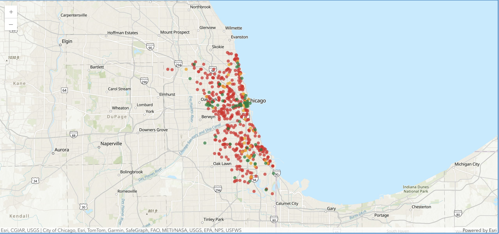
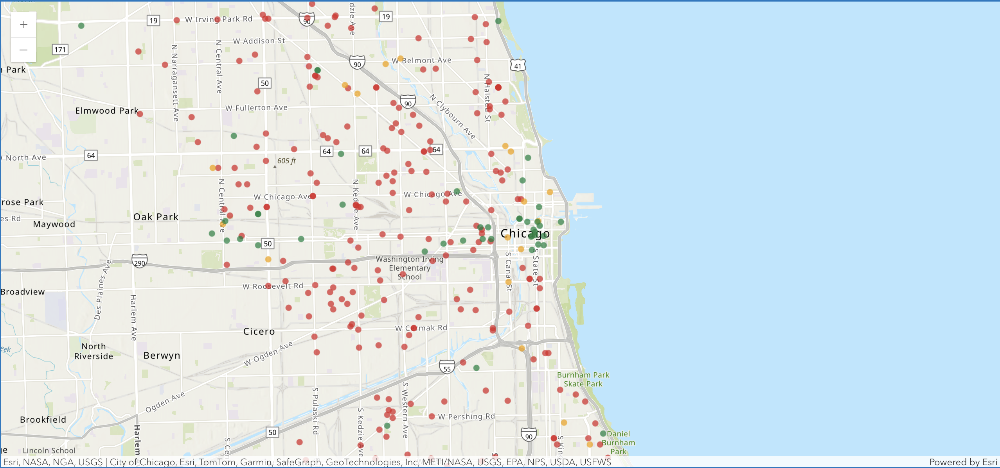

# ArcGIS Geocoding Accuracy on Chicago Crime Data

Chicago's public crime data masks addresses for privacy: `023XX N WESTERN AVE` instead of the real number. When you feed these into ArcGIS batch geocoding, it strips the "XX" and reads `023XX` as `23`. On Chicago's grid, that puts the pin kilometers away from where the crime actually happened.

This pipeline measures how far off those geocoded results actually are, using the real GPS coordinates from the dataset as ground truth.

## What I Found

I ran 500 records through ArcGIS geocoding:

- **100% match rate**: Every address returned a result.
- **95.1 average confidence score**: ArcGIS was very confident in its answers.
- **3.6 km median error**: But the actual locations were way off.

The confidence scores are misleading. 188 records (37.6%) scored above 90 but landed more than 5 km from the real location. The geocoder is good at matching the text of the address, but it doesn't account for the spatial error from stripping the masked digits.

When I compared masked vs. clean addresses, the difference was clear:
- **With "XX" masking:** 3,754m median error
- **Without masking:** 66m median error

The geocoder works fine on real addresses. The problem is specifically with how it handles the privacy mask.

## How It Works

1. **`pipeline/fetch_data.py`**: Pulls 500 crime records from Chicago's Socrata API. Each record has the masked block address and the actual GPS coordinates from dispatch.
2. **`pipeline/geocode_pipeline.py`**: Sends those addresses through ArcGIS Online batch geocoding.
3. **Error calculation**: Computes the Haversine distance between the real coordinates and where ArcGIS placed them.
4. **`tests/test_pipeline.py`**: A pytest suite that validates data integrity, match rates, and the distance math.

## Map

The notebook (`notebooks/analysis.ipynb`) maps the errors across Chicago:
- Green: within 500m
- Orange: 500m-1km off
- Red: over 1km off

Higher block numbers on the south and west sides get hit hardest: Stripping digits from `103XX` displaces a lot more than stripping them from `003XX`.





## Takeaway

ArcGIS confidence scores don't catch this problem. Filtering by `score > 90` won't help: Most of the bad results score that high anyway. If you're geocoding masked public records, you need to handle the masking before sending addresses to the geocoder.

---

## Running It

Python 3.9+, virtual environment recommended. No API keys needed, ArcGIS allows anonymous access for basic geocoding.

```bash
pip install -r requirements.txt

python pipeline/fetch_data.py
python pipeline/geocode_pipeline.py

pytest tests/test_pipeline.py -v
```

The CSVs are already in `data/`, so you can clone the repo and run `pytest` right away without re-running the pipeline.

For the interactive map, open `notebooks/analysis.ipynb` in JupyterLab (VS Code's notebook viewer doesn't support the ArcGIS map widget).
